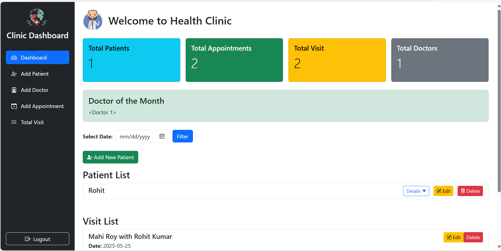

# ClinicManagementSystem



A web-based Clinic Management System built with Flask and SQLAlchemy to manage patients, doctors, appointments, and visits efficiently.

---

## Features

- **Patient Management:** Add, view, and manage patient details.
- **Doctor Management:** Track doctor information and monthly top performers.
- **Appointment Scheduling:** Book, update, and delete appointments.
- **Visit Records:** Manage patient visits and appointment history.
- **Dashboard:** Overview of total patients, doctors, appointments, and visits.
- **User Notifications:** Flash messages for success/error feedback.
- **Secure Routes:** CRUD operations protected by Flask routes.
- **Database:** Uses SQLAlchemy ORM with a relational database (e.g., SQLite/MySQL).

---

## Technologies Used

- Python 3.x
- Flask - Web framework
- Flask-SQLAlchemy - ORM for database management
- Flask-Migrate - Database migrations
- Jinja2 - Templating engine
- HTML5, CSS3, Bootstrap - Frontend styling and responsiveness
- Git & GitHub - Version control and remote repository

---

## Installation & Setup

1. **Clone the repository:**

   ```bash
   git clone https://github.com/Roymahi/ClinicManagementSystem.git
   cd ClinicManagementSystem
   ```

Contact
Contributors: Mahi Roy
GitHub: https://github.com/Roymahi
Email: snortsniper16@gmail.com
Contributor: Rohit Kumar
GitHub: https://github.com/rkstm7
Email: rkstm9@gmail.com
